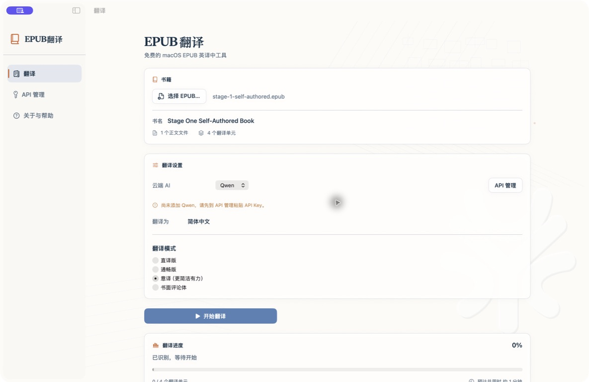
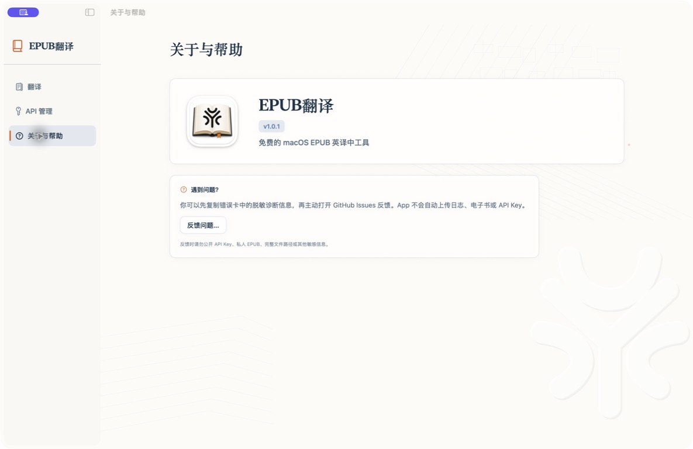

# EPUB翻译

一个免费的 macOS EPUB 英译中工具。

使用你自己的 Qwen 或 DeepSeek API，将英文 EPUB 翻译为简体中文，同时尽量保持原有章节、图片、链接和排版结构。

## [下载 EPUB翻译 v1.0.1](../../releases/tag/v1.0.1)

- 免费、无广告、无订阅
- 无需注册 EPUB Translator 账号
- 使用你自己的 Qwen 或 DeepSeek API
- API Key 仅保留在本次 App 运行的内存中，关闭 App 后自动清除
- 没有 EPUB Translator 项目服务器

## 界面预览

API 管理页会直接说明：验证通过后，API Key 仅保留在本次运行的内存中，关闭 App 后自动清除；App 不会读取或写入 macOS 钥匙串。

## 功能

- DRM-free EPUB → 简体中文 EPUB
- 支持 Qwen 与 DeepSeek
- 四种全书翻译模式
- 支持保存翻译进度并继续未完成任务
- 保持章节、图片、链接及基本格式
- 显示翻译单元、预计时间、进度和百分比
- 翻译完成后保存 EPUB，并可在 Finder 中显示

## 四种翻译模式

- **直译版**：最大程度忠实原文结构和表达。
- **通畅版（推荐）**：准确保留原意，同时使用自然流畅的中文。
- **意译（更简洁有力）**：在不改变核心意思的情况下减少英语式冗余。
- **书面评论体**：更正式、更成熟的中文书面表达。

## 系统要求

- macOS 13 Ventura 或更高版本
- Apple 芯片 Mac（arm64）
- DRM-free 英文 EPUB
- 用户自己的 Qwen 或 DeepSeek API Key
- 翻译期间需要网络连接

## 下载和安装

请从 [GitHub Releases](../../releases/tag/v1.0.1) 优先下载 `EPUB-Translator-v1.0.1.dmg`。完整步骤见 [安装说明](INSTALL.md)。

当前发布包使用本地签名，尚未经过 Apple Developer ID 公证。如果 macOS 阻止首次打开，请前往“系统设置 → 隐私与安全性”，找到 EPUB翻译并选择“仍要打开”。不需要关闭 Gatekeeper，也不需要运行 `sudo` 命令。

## API 申请

- [Qwen / 阿里云百炼 API Key 官方说明](https://help.aliyun.com/zh/model-studio/get-api-key/)
- [DeepSeek API 官方说明](https://api-docs.deepseek.com/zh-cn/)

服务商页面和收费政策可能变化，请以对应官方说明为准。

## 费用

EPUB Translator 本身免费，不销售 Token，也不收取 API 费用。

Qwen 或 DeepSeek 可能根据你的账户用量和服务商当前收费政策产生费用。这些费用由第三方服务商收取，与 EPUB Translator 无关。

## 隐私

EPUB 文件结构在本机处理。翻译所需的文本片段及少量相邻上下文会从你的 Mac 直接发送给你选择的 Qwen 或 DeepSeek；不会经过 EPUB Translator 项目服务器。详见 [隐私说明](PRIVACY.md)。

EPUB翻译不会持久保存您的 API Key。
API Key 仅在当前 App 运行期间使用，退出 App 后即清除。
下次启动时需要重新输入。

## 当前限制

- 仅支持 DRM-free EPUB，不支持 PDF、DOCX、MOBI 或 AZW。
- 不移除 Kindle DRM、Apple FairPlay DRM、Adobe DRM 或其他 DRM。
- 复杂 EPUB 的排版可能与原书存在差异。
- AI 翻译质量、速度、可用性和费用取决于第三方服务商。
- 恢复未完成的翻译任务后，需要重新输入并验证 API Key。
- v1.0.1 仅提供 Apple 芯片构建。
- 当前 Release 未做 Apple Developer ID 签名或 Apple 公证。

## 更多信息

- [源代码 / Source Code](https://github.com/yyttwo/EPUB-Translator)（Apache-2.0）
- [隐私说明](PRIVACY.md)
- [安全报告方式](SECURITY.md)
- [获得支持](SUPPORT.md)
- [更新记录](CHANGELOG.md)
- [v1.0.1 发布说明](docs/RELEASE_NOTES_v1.0.1.md)
- [v1.0.0 发布说明](docs/RELEASE_NOTES_v1.0.0.md)
